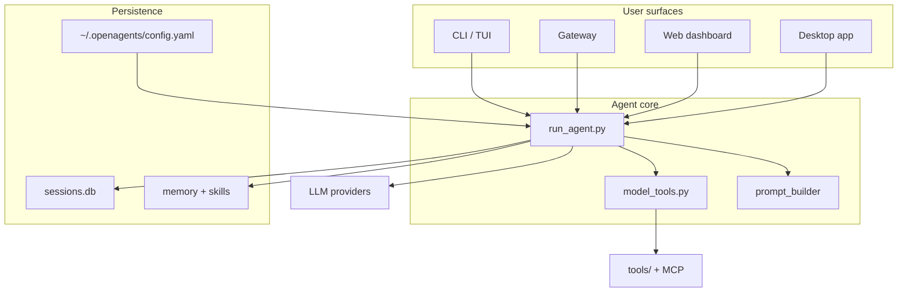

<p align="center">
  
</p>

# OpenAgents

<p align="center">
  <a href="https://github.com/RemiPelloux/OpenAgents/blob/main/LICENSE"></a>
  <a href="#"></a>
  <a href="#"></a>
</p>

**OpenAgents** is a self-hosted, multi-provider AI agent platform. Run the same agent from your terminal, messaging apps, desktop app, or web dashboard — with tools, memory, skills, scheduling, and subagent delegation built in.

This repository is a **professional fork and rename** of [Hermes Agent](https://github.com/NousResearch/Hermes-agent) by Nous Research. The upstream project remains the reference implementation; OpenAgents focuses on a clearer product identity, consistent naming, and a simpler onboarding path for teams building on the codebase.

---

## Why OpenAgents

| Capability | What you get |
|------------|--------------|
| **Multi-surface** | CLI, gateway (Telegram, Discord, Slack, WhatsApp, and more), TUI, desktop app, local web dashboard |
| **Model-agnostic** | OpenAI, Anthropic, OpenRouter, local endpoints, and many provider plugins |
| **Tooling** | Terminal, files, web, browser, MCP, code execution, subagents, cron |
| **Learning loop** | Persistent memory, skills hub, session search, optional Honcho integration |
| **Production-ready** | Profiles, credential pools, gateway services, Docker, security hardening |
| **Extensible** | Plugins, skills, hooks, and optional MCP catalogs |

---

## Quick start

### Prerequisites

- Python **3.11–3.13**
- Git
- Optional: [uv](https://github.com/astral-sh/uv) for faster installs

### Install from source

```bash
git clone https://github.com/RemiPelloux/OpenAgents.git
cd OpenAgents

# Create virtual environment
uv venv venv --python 3.11
source venv/bin/activate

# Install with all optional extras (recommended for development)
uv pip install -e ".[all,dev]"

# First-time setup
openagents setup
```

### Daily usage

```bash
openagents              # Interactive CLI
openagents model        # Choose provider and model
openagents gateway      # Start messaging gateway
openagents doctor       # Diagnose config and dependencies
openagents update       # Pull latest code and refresh dependencies
```

Configuration lives in **`~/.openagents/`** (config, API keys, sessions, skills, memory).

> **Migrating from Hermes?** Existing installs under `~/.Hermes` or `~/.hermes` are detected automatically. You can also set `OPENAGENTS_HOME` explicitly. The legacy CLI alias `hermes` still works during the transition.

---

## Project layout

```
OpenAgents/
├── openagents_cli/       # CLI, setup, gateway commands, config
├── openagents_constants.py
├── openagents_state.py     # Session storage (SQLite + FTS)
├── run_agent.py            # Core agent conversation loop
├── cli.py                  # Interactive terminal UI
├── model_tools.py          # Tool orchestration
├── tools/                  # Built-in tools (one module per tool)
├── gateway/                # Messaging platform adapters
├── agent/                  # Prompts, memory, routing, compression
├── plugins/                # Bundled plugins (memory, platforms, etc.)
├── skills/                 # Bundled skills
├── optional-skills/        # Optional skill packs
├── web/                    # Local web dashboard (React)
├── ui-tui/                 # Terminal UI package
├── apps/desktop/           # Electron desktop app
├── tests/                  # Pytest suite
└── website/docs/           # Documentation site source
```

---

## Architecture (high level)



**Design principles** (see [AGENTS.md](AGENTS.md) for full detail):

1. **Prompt caching is sacred** — do not mutate conversation context mid-turn except via compression.
2. **Core stays narrow** — new capability should land as skills, plugins, or gated tools before becoming core surface.

---

## Development

```bash
source venv/bin/activate
python -m pytest tests/ -q          # Full test suite
python -m pytest tests/openagents_cli/ -q
python -m pytest tests/tools/ -q
```

Read [AGENTS.md](AGENTS.md) before making changes — it documents module boundaries, config conventions, profiles, and testing expectations.

### Rename map (Hermes → OpenAgents)

| Hermes (legacy) | OpenAgents |
|-----------------|------------|
| `hermes` CLI | `openagents` |
| `hermes_cli/` | `openagents_cli/` |
| `get_hermes_home()` | `get_openagents_home()` |
| `OPENAGENTS_HOME` / `HERMES_HOME` | `OPENAGENTS_HOME` (legacy env vars still honored) |
| `~/.Hermes` | `~/.openagents` |
| Package `hermes-agent` | `openagents` |

---

## Updating

### Users (daily)

```bash
openagents update          # pull latest OpenAgents + refresh dependencies
openagents update --check  # see if an update is available
openagents doctor          # verify everything after an update
```

That pulls from **`origin`** ([RemiPelloux/OpenAgents](https://github.com/RemiPelloux/OpenAgents)) — already rebranded, ready to run.

### Maintainers (new Hermes Agent release)

When [NousResearch/Hermes-agent](https://github.com/NousResearch/Hermes-agent) publishes a new version:

```bash
./scripts/sync_from_hermes.sh        # merge upstream + rebrand + smoke tests
git commit -am "Sync Hermes upstream and reapply OpenAgents rebrand."
git push origin main
```

Full details: **[docs/UPSTREAM.md](docs/UPSTREAM.md)**

---

## Upstream lineage

OpenAgents tracks [NousResearch/Hermes-agent](https://github.com/NousResearch/Hermes-agent) for feature releases. Recommended remotes:

```bash
git remote add origin git@github.com:RemiPelloux/OpenAgents.git      # your install
git remote add upstream https://github.com/NousResearch/Hermes-agent.git  # Hermes source (maintainers)
```

Primary distribution: [RemiPelloux/OpenAgents](https://github.com/RemiPelloux/OpenAgents).

---

## License

[MIT](LICENSE) — original work © [Nous Research](https://nousresearch.com) (Hermes Agent); OpenAgents fork © Remi Pelloux (2026). Both notices must be retained in copies and derivative works.

