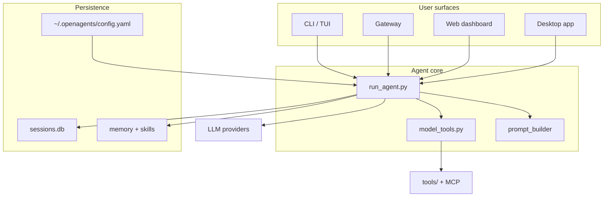

<p align="center">
  
</p>

# OpenAgents

<p align="center">
  <a href="https://github.com/RemiPelloux/OpenAgents/blob/main/LICENSE"></a>
  <a href="#"></a>
  <a href="#"></a>
</p>

**OpenAgents** is a self-hosted, multi-provider AI agent platform from **OpenPro**. Run the same agent from your terminal, messaging apps, desktop app, or web dashboard — with tools, memory, skills, scheduling, subagent delegation, and multi-agent **company workspaces** built in.

This repository is a **professional fork and rename** of [Hermes Agent](https://github.com/NousResearch/Hermes-agent) by Nous Research. The upstream project remains the reference implementation; OpenAgents focuses on OpenPro product identity, consistent naming, and a simpler onboarding path for teams building on the codebase.

---

## Why OpenAgents

| Capability | What you get |
|------------|--------------|
| **Multi-surface** | CLI, gateway (Telegram, Discord, Slack, WhatsApp, and more), TUI, desktop app, local web dashboard |
| **Model-agnostic** | OpenAI, Anthropic, OpenRouter, local endpoints, and many provider plugins |
| **Tooling** | Terminal, files, web, browser, MCP, code execution, subagents, cron |
| **Company workspaces** | `/company` scaffolds a folder with roles, subagent SOUL files, skills map, and CEO orchestration |
| **Visual workflows** | `/OpenAgentUI` — a local React Flow builder for chaining agent/tool/http/approval nodes; run saved scenarios with `/OpenAgentConfig`, or let any agent trigger them mid-conversation |
| **Learning loop** | Persistent memory, skills hub, session search, optional Honcho integration |
| **Production-ready** | Profiles, credential pools, gateway services, Docker, Tirith + built-in command scanner |
| **Extensible** | Plugins, skills, hooks, and optional MCP catalogs |

---

## Quick start

### Prerequisites

- Python **3.11–3.13**
- Git
- Optional: [uv](https://github.com/astral-sh/uv) for faster installs

### Install from source

```bash
git clone https://github.com/RemiPelloux/OpenAgents.git
cd OpenAgents

# One-command local install (venv + deps + global `openagents` command)
./scripts/install-local.sh

openagents setup          # first-time wizard (optional if install script ran)
```

No need to `source venv/bin/activate` — the installer links `openagents` into **`~/.local/bin`** via a fast launcher (bytecode cache under `~/.openagents/cache/pycache`). Ensure that directory is on your PATH:

```bash
export PATH="$HOME/.local/bin:$PATH"   # add to ~/.zshrc once if needed
```

**Pelloux fork standards:** [docs/PELLOUX_GUIDELINES.md](docs/PELLOUX_GUIDELINES.md) — install UX, OpenCode theme, performance defaults.

**Install flags:**

| Flag | Effect |
|------|--------|
| *(none)* | Reuse venv, install `.[all]`, link CLI |
| `--link-only` | Refresh `~/.local/bin` links only |
| `--recreate` | Delete and rebuild venv |
| `--dev` | Include pytest, ruff, etc. |

Or manually:

```bash
uv venv venv --python 3.11
source venv/bin/activate
uv pip install -e ".[all,dev]"
./scripts/install-local.sh   # re-run only the link step after manual pip install
openagents setup
```

**Theme & daily UX:** default skin is **OpenCode** (`display.skin: opencode`) — OpenPro branding, warm dark terminal, animated little-monster spinner, and `(◕‿◕) OpenPro` in the status bar. On launch: optional slime startup animation, resume-last-session (`session_on_launch: last`), and recent sessions list. Switch skins with `/skin opencode` or `/skin default`.

**Security:** dangerous terminal commands are scanned by a built-in checker and optional [Tirith](https://github.com/NousResearch/tirith) (`security.tirith_enabled: true` when installed via Homebrew).

### Connect OpenAI Codex (ChatGPT subscription)

```bash
openagents auth add openai-codex   # device-code login in browser
openagents model                   # select a Codex model (gpt-5.x, etc.)
openagents doctor                  # verify provider + credentials
```

Codex uses OAuth (not an API key). Works from CLI and the web dashboard (`openagents dashboard` → Providers → OpenAI Codex).

### Daily usage

```bash
openagents              # Interactive CLI (resumes last session by default)
openagents model        # Choose provider and model
openagents gateway      # Start messaging gateway
openagents doctor       # Diagnose config and dependencies
openagents update       # Pull latest code and refresh dependencies
```

Inside the CLI:

```text
/company init           # Guided setup — agent asks name, mission, roles, folder
/company delegate ceo … # Run work as the CEO orchestrator role
/sessions               # Browse and resume past sessions
/help                   # All slash commands
```

Configuration lives in **`~/.openagents/`** (config, API keys, sessions, skills, memory).

Example `~/.openagents/config.yaml` highlights:

```yaml
display:
  skin: opencode
  startup_animation: true
  session_on_launch: last      # new | last | prompt
  startup_show_sessions: true
security:
  builtin_command_scanner: true
  tirith_enabled: true
```

> **Migrating from Hermes?** Existing installs under `~/.Hermes` or `~/.hermes` are detected automatically. You can also set `OPENAGENTS_HOME` explicitly. The legacy CLI alias `hermes` still works during the transition.

---

## Company workspaces (`/company`)

Spin up a **multi-agent company** in a folder — roles, subagent personas, skills assignments, and a playbook for delegation.

| Command | What it does |
|---------|----------------|
| `/company init` | Guided interview (name, mission, template, roles, path) |
| `/company init Acme mission="…" template=startup` | Direct scaffold (power user) |
| `/company status` | Show manifest for the company in cwd |
| `/company roles` | List CEO, engineer, researcher, writer, ops, … |
| `/company delegate ceo <goal>` | Seed the agent as orchestrator for that goal |

**Templates:** `startup` (product team), `studio` (creative), `minimal` (ceo + worker).

**Folder layout** (created under your chosen path):

```
my-company/
├── company.yaml          # manifest — roles, mission, delegation defaults
├── COMPANY.md            # playbook for humans and agents
├── AGENTS.md             # auto-loaded when you work in this folder
├── roles/                # per-role toolsets and skills
├── agents/<role>/        # SOUL.md + agent.yaml for subagents
├── skills/assignments.yaml
└── workspace/            # deliverables
```

Terminal equivalent (used by the agent after guided init):

```bash
openagents company apply --name "Acme" --path ./acme --template startup --mission "Build our MVP"
```

Subagents are spawned via `delegate_task` or `/company delegate <role> …`. The CEO role uses `role='orchestrator'` to fan out parallel workers.

---

## Visual workflows (OpenAgentUI)

**OpenAgentUI** is a local-only visual workflow builder — a rebranded, native fork of [firecrawl/open-agent-builder](https://github.com/firecrawl/open-agent-builder) with the cloud dependencies (Convex, Clerk, Arcade, E2B) stripped out and replaced by OpenAgents' own agent loop, tool registry, and JSON-file persistence under `~/.openagents/openagentui/`.

| Command | What it does |
|---------|----------------|
| `/OpenAgentUI true` | Launch the local builder UI (React Flow canvas) and open it in your browser |
| `/OpenAgentUI stop` | Stop the builder UI process |
| `/OpenAgentConfig` | List saved workflows |
| `/OpenAgentConfig run <name> key=value ...` | Run a saved workflow headlessly (no UI process required) |
| `/OpenAgentConfig approve\|reject <execution_id>` | Resolve a paused `user-approval` node and resume |

Workflows chain `agent` (an LLM turn via `run_agent.py`), `mcp` (a deterministic call into any registered tool/plugin), `transform` (sandboxed Python), `http`, `if-else`/`while`, `user-approval`, and `set-state` nodes. Any agent/subagent can also trigger a saved workflow mid-conversation via the `run_openagentui_workflow` tool (toolset `openagentui`) — e.g. a flagship bundled scenario chains TikTok lead discovery into an OpenPro company + job post + outreach DM.

Full details, node-type reference, and REST/MCP contract: **[docs/openagentui.md](docs/openagentui.md)**.

---

## Project layout

```
OpenAgents/
├── openagents_cli/       # CLI, setup, gateway commands, config
├── openagents_constants.py
├── openagents_state.py     # Session storage (SQLite + FTS)
├── run_agent.py            # Core agent conversation loop
├── cli.py                  # Interactive terminal UI
├── model_tools.py          # Tool orchestration
├── tools/                  # Built-in tools (one module per tool)
├── gateway/                # Messaging platform adapters
├── agent/                  # Prompts, memory, routing, compression
├── plugins/                # Bundled plugins (memory, platforms, etc.)
├── skills/                 # Bundled skills
├── optional-skills/        # Optional skill packs
├── web/                    # Local web dashboard (React)
├── ui-tui/                 # Terminal UI package
├── apps/desktop/           # Electron desktop app
├── apps/openagentui/       # OpenAgentUI visual workflow builder (Next.js, rebranded)
├── openagentui/            # OpenAgentUI Python execution engine (schema, store, engine, node executors)
├── tests/                  # Pytest suite
└── website/docs/           # Documentation site source
```

---

## Architecture (high level)



**Design principles** (see [AGENTS.md](AGENTS.md) for full detail):

1. **Prompt caching is sacred** — do not mutate conversation context mid-turn except via compression.
2. **Core stays narrow** — new capability should land as skills, plugins, or gated tools before becoming core surface.

---

## Development

```bash
source venv/bin/activate
python -m pytest tests/ -q          # Full test suite
python -m pytest tests/openagents_cli/ -q
python -m pytest tests/tools/ -q
```

Read [AGENTS.md](AGENTS.md) before making changes — it documents module boundaries, config conventions, profiles, and testing expectations.

### Open ecosystem skills

Bundled skills for the Open product suite live under `skills/open-ecosystem/`:

| Skill | Product |
|-------|---------|
| `open-ecosystem-hub` | Routes across all Open products |
| `open-dev-workflow` | W4 ticket → OpenCode → QA playbook |
| `open-ticket` | OpenTicket MCP tools |
| `open-code` | OpenCode delegation via `invoke_opencode` |
| `openagents` | This repo (see `skills/autonomous-ai-agents/hermes-agent/`) |
| `open-pro` | Flutter hiring mobile app |
| `open-brain` | Shared MCP memory infrastructure |
| `open-memory` | OpenAgents memory + Honcho |
| `open-whistle` | Whistleblower compliance platform |
| `open-app` | Desktop, web dashboard, TUI |

Load with `/skills open-ecosystem-hub` or `openagents chat -s open-pro`.

### Rename map (Hermes → OpenAgents)

| Hermes (legacy) | OpenAgents |
|-----------------|------------|
| `hermes` CLI | `openagents` |
| `hermes_cli/` | `openagents_cli/` |
| `get_hermes_home()` | `get_openagents_home()` |
| `OPENAGENTS_HOME` / `HERMES_HOME` | `OPENAGENTS_HOME` (legacy env vars still honored) |
| `~/.Hermes` | `~/.openagents` |
| Package `hermes-agent` | `openagents` |

---

## Updating

### Users (daily)

```bash
openagents update          # pull latest OpenAgents + refresh dependencies
openagents update --check  # see if an update is available
openagents doctor          # verify everything after an update
```

That pulls from **`origin`** ([RemiPelloux/OpenAgents](https://github.com/RemiPelloux/OpenAgents)) — already rebranded, ready to run.

### Maintainers (new Hermes Agent release)

When [NousResearch/Hermes-agent](https://github.com/NousResearch/Hermes-agent) publishes a new version:

```bash
./scripts/sync_from_hermes.sh        # merge upstream + rebrand + smoke tests
git commit -am "Sync Hermes upstream and reapply OpenAgents rebrand."
git push origin main
```

Full details: **[docs/UPSTREAM.md](docs/UPSTREAM.md)**

---

## Upstream lineage

OpenAgents tracks [NousResearch/Hermes-agent](https://github.com/NousResearch/Hermes-agent) for feature releases. Recommended remotes:

```bash
git remote add origin git@github.com:RemiPelloux/OpenAgents.git      # your install
git remote add upstream https://github.com/NousResearch/Hermes-agent.git  # Hermes source (maintainers)
```

Primary distribution: [RemiPelloux/OpenAgents](https://github.com/RemiPelloux/OpenAgents).

---

## OpenOS Rust worker

The `openagents-worker` crate executes typed OpenOS engineering and skill-author
jobs. Engineering results include the exact changed-file set, base SHA, commit
SHA, and a SHA-256 digest as a persisted artifact. Skill authoring uses up to
eight extracted sources, makes at most two provider attempts (one transient
retry), and makes at most three model-backed candidate attempts (two repairs)
before failing explicitly. Strict source, criterion, and activation validation
remains authoritative.

The OpenOS worker gate runs `cargo test -p openagents-worker` on Linux, macOS,
and Windows with no skipped fallback path.

---

## OpenContract (OpenOS mesh)

OpenAgents is **producer** on W4/W1 hops (MCP tools, staging proposals). Wire signing when calling OpenTicket, OpenCRM, OpenCode.

| Contract | Role | Transport |
|----------|------|-----------|
| CC-W4-001 | Producer | MCP `create_ticket` |
| CC-W4-004 | Producer | `invoke_opencode` |
| CC-W1-003 | Producer | `POST OpenCRM /v1/staging` |

Env: `OPENCONTRACT_IDENTITY=OpenAgents`, `OPENCONTRACT_DEV_KEYS=1`, `OPENCONTRACT_URL=http://localhost:3070`.

Signed hops: `plugins/opencrm_sales/opencrm_client.py` wraps CC-W1-003 staging and CC-W1-004 prospection (as OpenTeam).

Docs: [Implementation rules](../docs/opencontract/OPENCONTRACT-IMPLEMENTATION-RULES.md) · [Handbook](../docs/opencontract/OPENCONTRACT-HANDBOOK.md) · skill [open-brain](skills/open-ecosystem/open-brain/SKILL.md)

---

## Company Brain (Axon)

OpenOS mesh docs are indexed in **OpenBrain**. Query via MCP `search_knowledge` with `domain: openos`.

- Skill: [skills/open-ecosystem/open-brain/SKILL.md](skills/open-ecosystem/open-brain/SKILL.md)
- Mesh env: [docs/openos-mesh-env.md](docs/openos-mesh-env.md)
- Sync: `../scripts/brain-sync-docs.sh --app OpenAgents` from OpenOS root

---

## License

[MIT](LICENSE) — original work © [Nous Research](https://nousresearch.com) (Hermes Agent); OpenAgents fork © Remi Pelloux (2026). Both notices must be retained in copies and derivative works.
