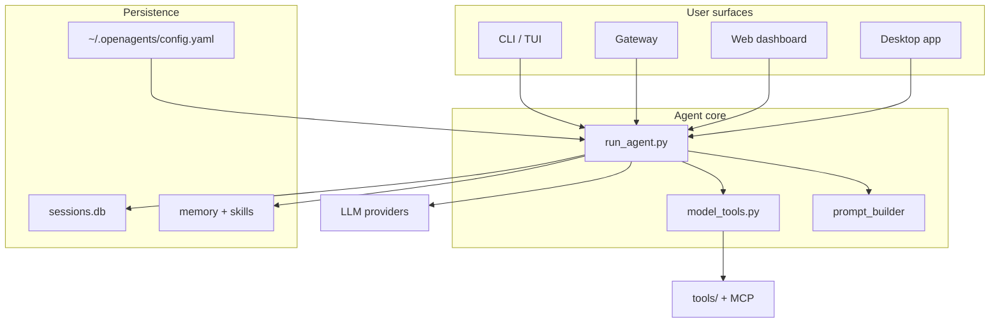

<p align="center">
  
</p>

# OpenAgents

<p align="center">
<<<<<<< HEAD
  <a href="https://github.com/RemiPelloux/OpenAgents/blob/main/LICENSE"></a>
  <a href="#"></a>
  <a href="#"></a>
||||||| cf299e9a01
  <a href="https://openagents.nousresearch.com/">OpenAgents</a> | <a href="https://openagents.nousresearch.com/">Hermes Desktop</a>
</p>
<p align="center">
  <a href="https://openagents.nousresearch.com/docs/"></a>
  <a href="https://discord.gg/NousResearch"></a>
  <a href="https://github.com/NousResearch/openagents/blob/main/LICENSE"></a>
  <a href="https://nousresearch.com"></a>
  <a href="README.zh-CN.md"></a>
  <a href="README.ur-pk.md"></a>
  <a href="README.es.md"></a>
=======
  <a href="https://hermes-agent.nousresearch.com/">OpenAgents</a> | <a href="https://hermes-agent.nousresearch.com/">Hermes Desktop</a>
</p>
<p align="center">
  <a href="https://hermes-agent.nousresearch.com/docs/"></a>
  <a href="https://discord.gg/NousResearch"></a>
  <a href="https://github.com/NousResearch/hermes-agent/blob/main/LICENSE"></a>
  <a href="https://nousresearch.com"></a>
  <a href="README.zh-CN.md"></a>
  <a href="README.ur-pk.md"></a>
  <a href="README.es.md"></a>
>>>>>>> rb/tag
</p>

**OpenAgents** is a self-hosted, multi-provider AI agent platform from **OpenPro**. Run the same agent from your terminal, messaging apps, desktop app, or web dashboard — with tools, memory, skills, scheduling, subagent delegation, and multi-agent **company workspaces** built in.

<<<<<<< HEAD
This repository is a **professional fork and rename** of [Hermes Agent](https://github.com/NousResearch/Hermes-agent) by Nous Research. The upstream project remains the reference implementation; OpenAgents focuses on OpenPro product identity, consistent naming, and a simpler onboarding path for teams building on the codebase.
||||||| cf299e9a01
Use any model you want — [Nous Portal](https://portal.nousresearch.com), OpenRouter, OpenAI, your own endpoint, and [many others](https://openagents.nousresearch.com/docs/integrations/providers). Switch with `hermes model` — no code changes, no lock-in.

<table>
<tr><td><b>A real terminal interface</b></td><td>Full TUI with multiline editing, slash-command autocomplete, conversation history, interrupt-and-redirect, and streaming tool output.</td></tr>
<tr><td><b>Lives where you do</b></td><td>Telegram, Discord, Slack, WhatsApp, Signal, and CLI — all from a single gateway process. Voice memo transcription, cross-platform conversation continuity.</td></tr>
<tr><td><b>A closed learning loop</b></td><td>Agent-curated memory with periodic nudges. Autonomous skill creation after complex tasks. Skills self-improve during use. FTS5 session search with LLM summarization for cross-session recall. <a href="https://github.com/plastic-labs/honcho">Honcho</a> dialectic user modeling. Compatible with the <a href="https://agentskills.io">agentskills.io</a> open standard.</td></tr>
<tr><td><b>Scheduled automations</b></td><td>Built-in cron scheduler with delivery to any platform. Daily reports, nightly backups, weekly audits — all in natural language, running unattended.</td></tr>
<tr><td><b>Delegates and parallelizes</b></td><td>Spawn isolated subagents for parallel workstreams. Write Python scripts that call tools via RPC, collapsing multi-step pipelines into zero-context-cost turns.</td></tr>
<tr><td><b>Runs anywhere, not just your laptop</b></td><td>Six terminal backends — local, Docker, SSH, Singularity, Modal, and Daytona. Daytona and Modal offer serverless persistence — your agent's environment hibernates when idle and wakes on demand, costing nearly nothing between sessions. Run it on a $5 VPS or a GPU cluster.</td></tr>
<tr><td><b>Research-ready</b></td><td>Batch trajectory generation, trajectory compression for training the next generation of tool-calling models.</td></tr>
</table>
=======
Use any model you want — [Nous Portal](https://portal.nousresearch.com), OpenRouter, OpenAI, your own endpoint, and [many others](https://hermes-agent.nousresearch.com/docs/integrations/providers). Switch with `hermes model` — no code changes, no lock-in.

<table>
<tr><td><b>A real terminal interface</b></td><td>Full TUI with multiline editing, slash-command autocomplete, conversation history, interrupt-and-redirect, and streaming tool output.</td></tr>
<tr><td><b>Lives where you do</b></td><td>Telegram, Discord, Slack, WhatsApp, Signal, and CLI — all from a single gateway process. Voice memo transcription, cross-platform conversation continuity.</td></tr>
<tr><td><b>A closed learning loop</b></td><td>Agent-curated memory with periodic nudges. Autonomous skill creation after complex tasks. Skills self-improve during use. FTS5 session search with LLM summarization for cross-session recall. <a href="https://github.com/plastic-labs/honcho">Honcho</a> dialectic user modeling. Compatible with the <a href="https://agentskills.io">agentskills.io</a> open standard.</td></tr>
<tr><td><b>Scheduled automations</b></td><td>Built-in cron scheduler with delivery to any platform. Daily reports, nightly backups, weekly audits — all in natural language, running unattended.</td></tr>
<tr><td><b>Delegates and parallelizes</b></td><td>Spawn isolated subagents for parallel workstreams. Write Python scripts that call tools via RPC, collapsing multi-step pipelines into zero-context-cost turns.</td></tr>
<tr><td><b>Runs anywhere, not just your laptop</b></td><td>Seven terminal backends — local, Docker, SSH, Singularity, Modal, Daytona, and Vercel Sandbox. Daytona and Modal offer serverless persistence — your agent's environment hibernates when idle and wakes on demand, costing nearly nothing between sessions. Run it on a $5 VPS or a GPU cluster.</td></tr>
<tr><td><b>Research-ready</b></td><td>Batch trajectory generation, trajectory compression for training the next generation of tool-calling models.</td></tr>
</table>
>>>>>>> rb/tag

---

## Why OpenAgents

| Capability | What you get |
|------------|--------------|
| **Multi-surface** | CLI, gateway (Telegram, Discord, Slack, WhatsApp, and more), TUI, desktop app, local web dashboard |
| **Model-agnostic** | OpenAI, Anthropic, OpenRouter, local endpoints, and many provider plugins |
| **Tooling** | Terminal, files, web, browser, MCP, code execution, subagents, cron |
| **Company workspaces** | `/company` scaffolds a folder with roles, subagent SOUL files, skills map, and CEO orchestration |
| **Visual workflows** | `/OpenAgentUI` — a local React Flow builder for chaining agent/tool/http/approval nodes; run saved scenarios with `/OpenAgentConfig`, or let any agent trigger them mid-conversation |
| **Learning loop** | Persistent memory, skills hub, session search, optional Honcho integration |
| **Production-ready** | Profiles, credential pools, gateway services, Docker, Tirith + built-in command scanner |
| **Extensible** | Plugins, skills, hooks, and optional MCP catalogs |

---

## Quick start

### Prerequisites

- Python **3.11–3.13**
- Git
- Optional: [uv](https://github.com/astral-sh/uv) for faster installs

### Install from source

```bash
<<<<<<< HEAD
git clone https://github.com/RemiPelloux/OpenAgents.git
cd OpenAgents

# One-command local install (venv + deps + global `openagents` command)
./scripts/install-local.sh

openagents setup          # first-time wizard (optional if install script ran)
||||||| cf299e9a01
curl -fsSL https://openagents.nousresearch.com/install.sh | bash
=======
curl -fsSL https://hermes-agent.nousresearch.com/install.sh | bash
>>>>>>> rb/tag
```

<<<<<<< HEAD
No need to `source venv/bin/activate` — the installer links `openagents` into **`~/.local/bin`** via a fast launcher (bytecode cache under `~/.openagents/cache/pycache`). Ensure that directory is on your PATH:
||||||| cf299e9a01
### Windows (native, PowerShell)

> **Heads up:** Native Windows runs OpenAgents without WSL — CLI, gateway, TUI, and tools all work natively. If you'd rather use WSL2, the Linux/macOS one-liner above works there too. Found a bug? Please [file issues](https://github.com/NousResearch/openagents/issues).

Run this in PowerShell:

```powershell
iex (irm https://openagents.nousresearch.com/install.ps1)
```

The installer handles everything: uv, Python 3.11, Node.js, ripgrep, ffmpeg, **and a portable Git Bash** (MinGit, unpacked to `%LOCALAPPDATA%\hermes\git` — no admin required, completely isolated from any system Git install). OpenAgents uses this bundled Git Bash to run shell commands.

If you already have Git installed, the installer detects it and uses that instead. Otherwise a ~45MB MinGit download is all you need — it won't touch or interfere with any system Git.

> **Android / Termux:** The tested manual path is documented in the [Termux guide](https://openagents.nousresearch.com/docs/getting-started/termux). On Termux, OpenAgents installs a curated `.[termux]` extra because the full `.[all]` extra currently pulls Android-incompatible voice dependencies.
>
> **Windows:** Native Windows is fully supported — the PowerShell one-liner above installs everything. If you'd rather use WSL2, the Linux command works there too. Native Windows install lives under `%LOCALAPPDATA%\hermes`; WSL2 installs under `~/.openagents` as on Linux.

After installation:
=======
### Windows (native, PowerShell)

> **Heads up:** Native Windows runs OpenAgents without WSL — CLI, gateway, TUI, and tools all work natively. If you'd rather use WSL2, the Linux/macOS one-liner above works there too. Found a bug? Please [file issues](https://github.com/NousResearch/hermes-agent/issues).

Run this in PowerShell:

```powershell
iex (irm https://hermes-agent.nousresearch.com/install.ps1)
```

The installer handles everything: uv, Python 3.11, Node.js, ripgrep, ffmpeg, **and a portable Git Bash** (MinGit, unpacked to `%LOCALAPPDATA%\hermes\git` — no admin required, completely isolated from any system Git install). OpenAgents uses this bundled Git Bash to run shell commands.

If you already have Git installed, the installer detects it and uses that instead. Otherwise a ~45MB MinGit download is all you need — it won't touch or interfere with any system Git.

> **Android / Termux:** The tested manual path is documented in the [Termux guide](https://hermes-agent.nousresearch.com/docs/getting-started/termux). On Termux, OpenAgents installs a curated `.[termux]` extra because the full `.[all]` extra currently pulls Android-incompatible voice dependencies.
>
> **Windows:** Native Windows is fully supported — the PowerShell one-liner above installs everything. If you'd rather use WSL2, the Linux command works there too. Native Windows install lives under `%LOCALAPPDATA%\hermes`; WSL2 installs under `~/.openagents` as on Linux.

After installation:
>>>>>>> rb/tag

```bash
export PATH="$HOME/.local/bin:$PATH"   # add to ~/.zshrc once if needed
```

**Pelloux fork standards:** [docs/PELLOUX_GUIDELINES.md](docs/PELLOUX_GUIDELINES.md) — install UX, OpenCode theme, performance defaults.

**Install flags:**

| Flag | Effect |
|------|--------|
| *(none)* | Reuse venv, install `.[all]`, link CLI |
| `--link-only` | Refresh `~/.local/bin` links only |
| `--recreate` | Delete and rebuild venv |
| `--dev` | Include pytest, ruff, etc. |

Or manually:

```bash
<<<<<<< HEAD
uv venv venv --python 3.11
source venv/bin/activate
||||||| cf299e9a01
hermes              # Interactive CLI — start a conversation
hermes model        # Choose your LLM provider and model
hermes tools        # Configure which tools are enabled
hermes config set   # Set individual config values
hermes gateway      # Start the messaging gateway (Telegram, Discord, etc.)
hermes setup        # Run the full setup wizard (configures everything at once)
hermes claw migrate # Migrate from OpenClaw (if coming from OpenClaw)
hermes update       # Update to the latest version
hermes doctor       # Diagnose any issues
```

📖 **[Full documentation →](https://openagents.nousresearch.com/docs/)**

---

## Skip the API-key collection — Nous Portal

OpenAgents works with whatever provider you want — that's not changing. But if you'd rather not collect five separate API keys for the model, web search, image generation, TTS, and a cloud browser, **[Nous Portal](https://portal.nousresearch.com)** covers all of them under one subscription:

- **300+ models** — pick any of them with `/model <name>`
- **Tool Gateway** — web search (Firecrawl), image generation (FAL), text-to-speech (OpenAI), cloud browser (Browser Use), all routed through your sub. No extra accounts.

One command from a fresh install:

```bash
hermes setup --portal
```

That logs you in via OAuth, sets Nous as your provider, and turns on the Tool Gateway. Check what's wired up any time with `hermes portal info`. Full details on the [Tool Gateway docs page](https://openagents.nousresearch.com/docs/user-guide/features/tool-gateway).

You can still bring your own keys per-tool whenever you want — the gateway is per-backend, not all-or-nothing.

---

## CLI vs Messaging Quick Reference

OpenAgents has two entry points: start the terminal UI with `hermes`, or run the gateway and talk to it from Telegram, Discord, Slack, WhatsApp, Signal, or Email. Once you're in a conversation, many slash commands are shared across both interfaces.

| Action                         | CLI                                           | Messaging platforms                                                              |
| ------------------------------ | --------------------------------------------- | -------------------------------------------------------------------------------- |
| Start chatting                 | `hermes`                                      | Run `hermes gateway setup` + `hermes gateway start`, then send the bot a message |
| Start fresh conversation       | `/new` or `/reset`                            | `/new` or `/reset`                                                               |
| Change model                   | `/model [provider:model]`                     | `/model [provider:model]`                                                        |
| Set a personality              | `/personality [name]`                         | `/personality [name]`                                                            |
| Retry or undo the last turn    | `/retry`, `/undo`                             | `/retry`, `/undo`                                                                |
| Compress context / check usage | `/compress`, `/usage`, `/insights [--days N]` | `/compress`, `/usage`, `/insights [days]`                                        |
| Browse skills                  | `/skills` or `/<skill-name>`                  | `/<skill-name>`                                                                  |
| Interrupt current work         | `Ctrl+C` or send a new message                | `/stop` or send a new message                                                    |
| Platform-specific status       | `/platforms`                                  | `/status`, `/sethome`                                                            |

For the full command lists, see the [CLI guide](https://openagents.nousresearch.com/docs/user-guide/cli) and the [Messaging Gateway guide](https://openagents.nousresearch.com/docs/user-guide/messaging).

---

## Documentation

All documentation lives at **[openagents.nousresearch.com/docs](https://openagents.nousresearch.com/docs/)**:

| Section                                                                                             | What's Covered                                             |
| --------------------------------------------------------------------------------------------------- | ---------------------------------------------------------- |
| [Quickstart](https://openagents.nousresearch.com/docs/getting-started/quickstart)                 | Install → setup → first conversation in 2 minutes          |
| [CLI Usage](https://openagents.nousresearch.com/docs/user-guide/cli)                              | Commands, keybindings, personalities, sessions             |
| [Configuration](https://openagents.nousresearch.com/docs/user-guide/configuration)                | Config file, providers, models, all options                |
| [Messaging Gateway](https://openagents.nousresearch.com/docs/user-guide/messaging)                | Telegram, Discord, Slack, WhatsApp, Signal, Home Assistant |
| [Security](https://openagents.nousresearch.com/docs/user-guide/security)                          | Command approval, DM pairing, container isolation          |
| [Tools & Toolsets](https://openagents.nousresearch.com/docs/user-guide/features/tools)            | 40+ tools, toolset system, terminal backends               |
| [Skills System](https://openagents.nousresearch.com/docs/user-guide/features/skills)              | Procedural memory, Skills Hub, creating skills             |
| [Memory](https://openagents.nousresearch.com/docs/user-guide/features/memory)                     | Persistent memory, user profiles, best practices           |
| [MCP Integration](https://openagents.nousresearch.com/docs/user-guide/features/mcp)               | Connect any MCP server for extended capabilities           |
| [Cron Scheduling](https://openagents.nousresearch.com/docs/user-guide/features/cron)              | Scheduled tasks with platform delivery                     |
| [Context Files](https://openagents.nousresearch.com/docs/user-guide/features/context-files)       | Project context that shapes every conversation             |
| [Architecture](https://openagents.nousresearch.com/docs/developer-guide/architecture)             | Project structure, agent loop, key classes                 |
| [Contributing](https://openagents.nousresearch.com/docs/developer-guide/contributing)             | Development setup, PR process, code style                  |
| [CLI Reference](https://openagents.nousresearch.com/docs/reference/cli-commands)                  | All commands and flags                                     |
| [Environment Variables](https://openagents.nousresearch.com/docs/reference/environment-variables) | Complete env var reference                                 |

---

## Migrating from OpenClaw

If you're coming from OpenClaw, OpenAgents can automatically import your settings, memories, skills, and API keys.

**During first-time setup:** The setup wizard (`hermes setup`) automatically detects `~/.openclaw` and offers to migrate before configuration begins.

**Anytime after install:**

```bash
hermes claw migrate              # Interactive migration (full preset)
hermes claw migrate --dry-run    # Preview what would be migrated
hermes claw migrate --preset user-data   # Migrate without secrets
hermes claw migrate --overwrite  # Overwrite existing conflicts
```

What gets imported:

- **SOUL.md** — persona file
- **Memories** — MEMORY.md and USER.md entries
- **Skills** — user-created skills → `~/.openagents/skills/openclaw-imports/`
- **Command allowlist** — approval patterns
- **Messaging settings** — platform configs, allowed users, working directory
- **API keys** — allowlisted secrets (Telegram, OpenRouter, OpenAI, Anthropic, ElevenLabs)
- **TTS assets** — workspace audio files
- **Workspace instructions** — AGENTS.md (with `--workspace-target`)

See `hermes claw migrate --help` for all options, or use the `openclaw-migration` skill for an interactive agent-guided migration with dry-run previews.

---

## Contributing

We welcome contributions! See the [Contributing Guide](https://openagents.nousresearch.com/docs/developer-guide/contributing) for development setup, code style, and PR process.

Quick start for contributors — use the standard installer, then work from the
full git checkout it creates at `$OPENAGENTS_HOME/openagents` (usually
`~/.openagents/openagents`). This matches the layout used by `hermes update`, the
managed venv, lazy dependencies, gateway, and docs tooling.

```bash
curl -fsSL https://openagents.nousresearch.com/install.sh | bash
cd "${OPENAGENTS_HOME:-$HOME/.hermes}/openagents"
=======
hermes              # Interactive CLI — start a conversation
hermes model        # Choose your LLM provider and model
hermes tools        # Configure which tools are enabled
hermes config set   # Set individual config values
hermes config get   # Print individual config values
hermes gateway      # Start the messaging gateway (Telegram, Discord, etc.)
hermes setup        # Run the full setup wizard (configures everything at once)
hermes claw migrate # Migrate from OpenClaw (if coming from OpenClaw)
hermes update       # Update to the latest version
hermes doctor       # Diagnose any issues
```

📖 **[Full documentation →](https://hermes-agent.nousresearch.com/docs/)**

---

## Skip the API-key collection — Nous Portal

OpenAgents works with whatever provider you want — that's not changing. But if you'd rather not collect five separate API keys for the model, web search, image generation, TTS, and a cloud browser, **[Nous Portal](https://portal.nousresearch.com)** covers all of them under one subscription:

- **300+ models** — pick any of them with `/model <name>`
- **Tool Gateway** — web search (Firecrawl), image generation (FAL), text-to-speech (OpenAI), cloud browser (Browser Use), all routed through your sub. No extra accounts.

One command from a fresh install:

```bash
hermes setup --portal
```

That logs you in via OAuth, sets Nous as your provider, and turns on the Tool Gateway. Check what's wired up any time with `hermes portal info`. Full details on the [Tool Gateway docs page](https://hermes-agent.nousresearch.com/docs/user-guide/features/tool-gateway).

You can still bring your own keys per-tool whenever you want — the gateway is per-backend, not all-or-nothing.

---

## CLI vs Messaging Quick Reference

OpenAgents has two entry points: start the terminal UI with `hermes`, or run the gateway and talk to it from Telegram, Discord, Slack, WhatsApp, Signal, or Email. Once you're in a conversation, many slash commands are shared across both interfaces.

| Action                         | CLI                                           | Messaging platforms                                                              |
| ------------------------------ | --------------------------------------------- | -------------------------------------------------------------------------------- |
| Start chatting                 | `hermes`                                      | Run `hermes gateway setup` + `hermes gateway start`, then send the bot a message |
| Start fresh conversation       | `/new` or `/reset`                            | `/new` or `/reset`                                                               |
| Change model                   | `/model [provider:model]`                     | `/model [provider:model]`                                                        |
| Set a personality              | `/personality [name]`                         | `/personality [name]`                                                            |
| Retry or undo the last turn    | `/retry`, `/undo`                             | `/retry`, `/undo`                                                                |
| Compress context / check usage | `/compress`, `/usage`, `/insights [--days N]` | `/compress`, `/usage`, `/insights [days]`                                        |
| Browse skills                  | `/skills` or `/<skill-name>`                  | `/<skill-name>`                                                                  |
| Interrupt current work         | `Ctrl+C` or send a new message                | `/stop` or send a new message                                                    |
| Platform-specific status       | `/platforms`                                  | `/status`, `/sethome`                                                            |

For the full command lists, see the [CLI guide](https://hermes-agent.nousresearch.com/docs/user-guide/cli) and the [Messaging Gateway guide](https://hermes-agent.nousresearch.com/docs/user-guide/messaging).

---

## Documentation

All documentation lives at **[hermes-agent.nousresearch.com/docs](https://hermes-agent.nousresearch.com/docs/)**:

| Section                                                                                             | What's Covered                                             |
| --------------------------------------------------------------------------------------------------- | ---------------------------------------------------------- |
| [Quickstart](https://hermes-agent.nousresearch.com/docs/getting-started/quickstart)                 | Install → setup → first conversation in 2 minutes          |
| [CLI Usage](https://hermes-agent.nousresearch.com/docs/user-guide/cli)                              | Commands, keybindings, personalities, sessions             |
| [Configuration](https://hermes-agent.nousresearch.com/docs/user-guide/configuration)                | Config file, providers, models, all options                |
| [Messaging Gateway](https://hermes-agent.nousresearch.com/docs/user-guide/messaging)                | Telegram, Discord, Slack, WhatsApp, Signal, Home Assistant |
| [Security](https://hermes-agent.nousresearch.com/docs/user-guide/security)                          | Command approval, DM pairing, container isolation          |
| [Tools & Toolsets](https://hermes-agent.nousresearch.com/docs/user-guide/features/tools)            | 40+ tools, toolset system, terminal backends               |
| [Skills System](https://hermes-agent.nousresearch.com/docs/user-guide/features/skills)              | Procedural memory, Skills Hub, creating skills             |
| [Memory](https://hermes-agent.nousresearch.com/docs/user-guide/features/memory)                     | Persistent memory, user profiles, best practices           |
| [MCP Integration](https://hermes-agent.nousresearch.com/docs/user-guide/features/mcp)               | Connect any MCP server for extended capabilities           |
| [Cron Scheduling](https://hermes-agent.nousresearch.com/docs/user-guide/features/cron)              | Scheduled tasks with platform delivery                     |
| [Context Files](https://hermes-agent.nousresearch.com/docs/user-guide/features/context-files)       | Project context that shapes every conversation             |
| [Architecture](https://hermes-agent.nousresearch.com/docs/developer-guide/architecture)             | Project structure, agent loop, key classes                 |
| [Contributing](https://hermes-agent.nousresearch.com/docs/developer-guide/contributing)             | Development setup, PR process, code style                  |
| [CLI Reference](https://hermes-agent.nousresearch.com/docs/reference/cli-commands)                  | All commands and flags                                     |
| [Environment Variables](https://hermes-agent.nousresearch.com/docs/reference/environment-variables) | Complete env var reference                                 |

---

## Migrating from OpenClaw

If you're coming from OpenClaw, OpenAgents can automatically import your settings, memories, skills, and API keys.

**During first-time setup:** The setup wizard (`hermes setup`) automatically detects `~/.openclaw` and offers to migrate before configuration begins.

**Anytime after install:**

```bash
hermes claw migrate              # Interactive migration (full preset)
hermes claw migrate --dry-run    # Preview what would be migrated
hermes claw migrate --preset user-data   # Migrate without secrets
hermes claw migrate --overwrite  # Overwrite existing conflicts
```

What gets imported:

- **SOUL.md** — persona file
- **Memories** — MEMORY.md and USER.md entries
- **Skills** — user-created skills → `~/.openagents/skills/openclaw-imports/`
- **Command allowlist** — approval patterns
- **Messaging settings** — platform configs, allowed users, working directory
- **API keys** — allowlisted secrets (Telegram, OpenRouter, OpenAI, Anthropic, ElevenLabs)
- **TTS assets** — workspace audio files
- **Workspace instructions** — AGENTS.md (with `--workspace-target`)

See `hermes claw migrate --help` for all options, or use the `openclaw-migration` skill for an interactive agent-guided migration with dry-run previews.

---

## Contributing

We welcome contributions! See the [Contributing Guide](https://hermes-agent.nousresearch.com/docs/developer-guide/contributing) for development setup, code style, and PR process.

Quick start for contributors — use the standard installer, then work from the
full git checkout it creates at `$OPENAGENTS_HOME/openagents` (usually
`~/.openagents/openagents`). This matches the layout used by `hermes update`, the
managed venv, lazy dependencies, gateway, and docs tooling.

```bash
curl -fsSL https://hermes-agent.nousresearch.com/install.sh | bash
cd "${OPENAGENTS_HOME:-$HOME/.hermes}/openagents"
>>>>>>> rb/tag
uv pip install -e ".[all,dev]"
./scripts/install-local.sh   # re-run only the link step after manual pip install
openagents setup
```

**Theme & daily UX:** default skin is **OpenCode** (`display.skin: opencode`) — OpenPro branding, warm dark terminal, animated little-monster spinner, and `(◕‿◕) OpenPro` in the status bar. On launch: optional slime startup animation, resume-last-session (`session_on_launch: last`), and recent sessions list. Switch skins with `/skin opencode` or `/skin default`.

**Security:** dangerous terminal commands are scanned by a built-in checker and optional [Tirith](https://github.com/NousResearch/tirith) (`security.tirith_enabled: true` when installed via Homebrew).

### Connect OpenAI Codex (ChatGPT subscription)

Create the venv outside the cloned source tree — a venv inside the directory
the agent operates from can be wiped by a relative-path command the agent runs
against its own checkout, destroying the running runtime mid-session.

```bash
<<<<<<< HEAD
openagents auth add openai-codex   # device-code login in browser
openagents model                   # select a Codex model (gpt-5.x, etc.)
openagents doctor                  # verify provider + credentials
```

Codex uses OAuth (not an API key). Works from CLI and the web dashboard (`openagents dashboard` → Providers → OpenAI Codex).

### Daily usage

```bash
openagents              # Interactive CLI (resumes last session by default)
openagents model        # Choose provider and model
openagents gateway      # Start messaging gateway
openagents doctor       # Diagnose config and dependencies
openagents update       # Pull latest code and refresh dependencies
```

Inside the CLI:

```text
/company init           # Guided setup — agent asks name, mission, roles, folder
/company delegate ceo … # Run work as the CEO orchestrator role
/sessions               # Browse and resume past sessions
/help                   # All slash commands
```

Configuration lives in **`~/.openagents/`** (config, API keys, sessions, skills, memory).

Example `~/.openagents/config.yaml` highlights:

```yaml
display:
  skin: opencode
  startup_animation: true
  session_on_launch: last      # new | last | prompt
  startup_show_sessions: true
security:
  builtin_command_scanner: true
  tirith_enabled: true
```

> **Migrating from Hermes?** Existing installs under `~/.Hermes` or `~/.hermes` are detected automatically. You can also set `OPENAGENTS_HOME` explicitly. The legacy CLI alias `hermes` still works during the transition.

---

## Company workspaces (`/company`)

Spin up a **multi-agent company** in a folder — roles, subagent personas, skills assignments, and a playbook for delegation.

| Command | What it does |
|---------|----------------|
| `/company init` | Guided interview (name, mission, template, roles, path) |
| `/company init Acme mission="…" template=startup` | Direct scaffold (power user) |
| `/company status` | Show manifest for the company in cwd |
| `/company roles` | List CEO, engineer, researcher, writer, ops, … |
| `/company delegate ceo <goal>` | Seed the agent as orchestrator for that goal |

**Templates:** `startup` (product team), `studio` (creative), `minimal` (ceo + worker).

**Folder layout** (created under your chosen path):

```
my-company/
├── company.yaml          # manifest — roles, mission, delegation defaults
├── COMPANY.md            # playbook for humans and agents
├── AGENTS.md             # auto-loaded when you work in this folder
├── roles/                # per-role toolsets and skills
├── agents/<role>/        # SOUL.md + agent.yaml for subagents
├── skills/assignments.yaml
└── workspace/            # deliverables
```

Terminal equivalent (used by the agent after guided init):

```bash
openagents company apply --name "Acme" --path ./acme --template startup --mission "Build our MVP"
```

Subagents are spawned via `delegate_task` or `/company delegate <role> …`. The CEO role uses `role='orchestrator'` to fan out parallel workers. Pass a top-level `model` to set the default child model, or set `model` on individual batch tasks to run independent workstreams on different models while reusing the configured delegation provider credentials.

---

## Visual workflows (OpenAgentUI)

**OpenAgentUI** is a local-only visual workflow builder — a rebranded, native fork of [firecrawl/open-agent-builder](https://github.com/firecrawl/open-agent-builder) with the cloud dependencies (Convex, Clerk, Arcade, E2B) stripped out and replaced by OpenAgents' own agent loop, tool registry, and JSON-file persistence under `~/.openagents/openagentui/`.

| Command | What it does |
|---------|----------------|
| `/OpenAgentUI true` | Launch the local builder UI (React Flow canvas) and open it in your browser |
| `/OpenAgentUI stop` | Stop the builder UI process |
| `/OpenAgentConfig` | List saved workflows |
| `/OpenAgentConfig run <name> key=value ...` | Run a saved workflow headlessly (no UI process required) |
| `/OpenAgentConfig approve\|reject <execution_id>` | Resolve a paused `user-approval` node and resume |

Workflows chain `agent` (an LLM turn via `run_agent.py`), `mcp` (a deterministic call into any registered tool/plugin), `transform` (sandboxed Python), `http`, `if-else`/`while`, `user-approval`, and `set-state` nodes. Any agent/subagent can also trigger a saved workflow mid-conversation via the `run_openagentui_workflow` tool (toolset `openagentui`) — e.g. a flagship bundled scenario chains TikTok lead discovery into an OpenPro company + job post + outreach DM.

Full details, node-type reference, and REST/MCP contract: **[docs/openagentui.md](docs/openagentui.md)**.

---

## Project layout

```
OpenAgents/
├── openagents_cli/       # CLI, setup, gateway commands, config
├── openagents_constants.py
├── openagents_state.py     # Session storage (SQLite + FTS)
├── run_agent.py            # Core agent conversation loop
├── cli.py                  # Interactive terminal UI
├── model_tools.py          # Tool orchestration
├── tools/                  # Built-in tools (one module per tool)
├── gateway/                # Messaging platform adapters
├── agent/                  # Prompts, memory, routing, compression
├── plugins/                # Bundled plugins (memory, platforms, etc.)
├── skills/                 # Bundled skills
├── optional-skills/        # Optional skill packs
├── web/                    # Local web dashboard (React)
├── ui-tui/                 # Terminal UI package
├── apps/desktop/           # Electron desktop app
├── apps/openagentui/       # OpenAgentUI visual workflow builder (Next.js, rebranded)
├── openagentui/            # OpenAgentUI Python execution engine (schema, store, engine, node executors)
├── tests/                  # Pytest suite
└── website/docs/           # Documentation site source
||||||| cf299e9a01
curl -LsSf https://astral.sh/uv/install.sh | sh
uv venv .venv --python 3.11
source .venv/bin/activate
uv pip install -e ".[all,dev]"
scripts/run_tests.sh
=======
curl -LsSf https://astral.sh/uv/install.sh | sh
uv venv ~/.openagents/venvs/hermes-dev --python 3.11
source ~/.openagents/venvs/hermes-dev/bin/activate
uv pip install -e ".[all,dev]"
scripts/run_tests.sh
>>>>>>> rb/tag
```

---

## Architecture (high level)

<<<<<<< HEAD

```mermaid
flowchart TB
  subgraph surfaces [User surfaces]
    CLI[CLI / TUI]
    GW[Gateway]
    WEB[Web dashboard]
    DESK[Desktop app]
  end

  subgraph core [Agent core]
    RA[run_agent.py]
    MT[model_tools.py]
    PB[prompt_builder]
  end

  subgraph data [Persistence]
    CFG[~/.openagents/config.yaml]
    SESS[sessions.db]
    MEM[memory + skills]
  end

  CLI --> RA
  GW --> RA
  WEB --> RA
  DESK --> RA
  RA --> MT
  RA --> PB
  RA --> LLM[LLM providers]
  MT --> TOOLS[tools/ + MCP]
  RA --> SESS
  RA --> MEM
  CFG --> RA
```

**Design principles** (see [AGENTS.md](AGENTS.md) for full detail):

1. **Prompt caching is sacred** — do not mutate conversation context mid-turn except via compression.
2. **Core stays narrow** — new capability should land as skills, plugins, or gated tools before becoming core surface.

---

## Development

```bash
source venv/bin/activate
python -m pytest tests/ -q          # Full test suite
python -m pytest tests/openagents_cli/ -q
python -m pytest tests/tools/ -q
```

Read [AGENTS.md](AGENTS.md) before making changes — it documents module boundaries, config conventions, profiles, and testing expectations.

### Open ecosystem skills

Bundled skills for the Open product suite live under `skills/open-ecosystem/`:

| Skill | Product |
|-------|---------|
| `open-ecosystem-hub` | Routes across all Open products |
| `open-dev-workflow` | W4 ticket → OpenCode → QA playbook |
| `open-ticket` | OpenTicket MCP tools |
| `open-code` | OpenCode delegation via `invoke_opencode` |
| `openagents` | This repo (see `skills/autonomous-ai-agents/hermes-agent/`) |
| `open-pro` | Flutter hiring mobile app |
| `open-brain` | Shared MCP memory infrastructure |
| `open-memory` | OpenAgents memory + Honcho |
| `open-app` | Desktop, web dashboard, TUI |

Load with `/skills open-ecosystem-hub` or `openagents chat -s open-pro`.

### Rename map (Hermes → OpenAgents)

| Hermes (legacy) | OpenAgents |
|-----------------|------------|
| `hermes` CLI | `openagents` |
| `hermes_cli/` | `openagents_cli/` |
| `get_hermes_home()` | `get_openagents_home()` |
| `OPENAGENTS_HOME` / `HERMES_HOME` | `OPENAGENTS_HOME` (legacy env vars still honored) |
| `~/.Hermes` | `~/.openagents` |
| Package `hermes-agent` | `openagents` |

---

## Updating

### Users (daily)

```bash
openagents update          # pull latest OpenAgents + refresh dependencies
openagents update --check  # see if an update is available
openagents doctor          # verify everything after an update
```

That pulls from **`origin`** ([RemiPelloux/OpenAgents](https://github.com/RemiPelloux/OpenAgents)) — already rebranded, ready to run.

### Maintainers (new Hermes Agent release)

When [NousResearch/Hermes-agent](https://github.com/NousResearch/Hermes-agent) publishes a new version:

```bash
./scripts/sync_from_hermes.sh        # merge upstream + rebrand + smoke tests
git commit -am "Sync Hermes upstream and reapply OpenAgents rebrand."
git push origin main
```

Full details: **[docs/UPSTREAM.md](docs/UPSTREAM.md)**

---

## Upstream lineage

OpenAgents tracks [NousResearch/Hermes-agent](https://github.com/NousResearch/Hermes-agent) for feature releases. Recommended remotes:

```bash
git remote add origin git@github.com:RemiPelloux/OpenAgents.git      # your install
git remote add upstream https://github.com/NousResearch/Hermes-agent.git  # Hermes source (maintainers)
```

Primary distribution: [RemiPelloux/OpenAgents](https://github.com/RemiPelloux/OpenAgents).

---

## OpenOS Rust worker

The `openagents-worker` crate executes typed OpenOS engineering and skill-author
jobs. Engineering results include the exact changed-file set, base SHA, commit
SHA, and a SHA-256 digest as a persisted artifact. Skill authoring uses up to
eight extracted sources, makes at most two provider attempts (one transient
retry), and makes at most three model-backed candidate attempts (two repairs)
before failing explicitly. Strict source, criterion, and activation validation
remains authoritative.

For OpenOS engineering, the worker creates
`<managed-root>/<organization>/<plan>/<repository-name>`, never edits the source
checkout directly, and runs Orchestrator-injected QA for every affected product
surface. It creates and verifies one signed commit first, runs QA against that
exact commit, and rejects any QA command that changes `HEAD`, the index, or the
worktree. Only then does it push without force and idempotently create a GitHub
draft PR. The model-backed acceptance
audit then receives the committed diff, QA logs, and verified delivery state;
the worker rechecks that the PR is still open, draft, unmerged, and has no
auto-merge before completion. Lost leases fence execution, while transient
heartbeats and idempotent completion callbacks are retried. The worker never
merges. `GH_TOKEN` and `OPENAGENTS_GIT_SIGNING_KEY_B64` must be
provisioned before health can pass. The runtime image includes Node.js, pnpm,
and Python. Registration publishes a detected `toolchain.*` capability matrix;
repositories whose QA requires browser, Rust, Go, Java, Flutter, Android, or
Apple tooling need a worker image that actually contains that toolchain. It is
never inferred from a project name or claimed when absent. Fetch/push use the registered HTTPS remote so an
equivalent SSH `origin` never requires mounting a personal SSH key; see
[`../docs/ENGINEERING-WORKSPACES.md`](../docs/ENGINEERING-WORKSPACES.md).

The managed worktree provides path separation and Git evidence, not an OS-level
security sandbox. Repository code and QA must not be treated as untrusted until
execution moves behind a credential-isolated sandbox and a separate Git signing
and delivery broker.

Managed H-ACN events use a parent-only sink. OpenCode removes the sink path from
every Bash, MCP, LSP, and hook subprocess environment before repository code is
executed, preventing those tools from directly forging cognitive observations.

Skill-author jobs also require an approved generalization contract. The worker
checks runtime parameters, discovery branches, invariants, distinct validation
instances, and the generated `SKILL.md` parameter surface. It rejects instance
URLs embedded as required procedure constants. Engineering jobs receive the
same bounded rule: parameterize facts that vary, discover missing evidence,
test a materially different instance, and avoid abstractions without a concrete
second use case.

The OpenOS worker gate runs `cargo test -p openagents-worker` on Linux, macOS,
and Windows with no skipped fallback path.

### Cognitive observations and background review

OpenOS engineering results can include structured `cognitive_observations` for
tool corrections, missed expectations, authorization blocks, acceptance
failures, selected strategies, and grounded adaptation proposals. The field is
optional with an empty default, preserving worker-v1 compatibility.

The background reviewer is proposal-only. Its only mutation-shaped tool is the
read-only `propose_improvement` tool, which returns a versionable memory,
prompt, routing, or skill candidate plus evidence references. It never edits
`MEMORY.md`, user memory, or a skill. OpenOrchestrator enriches and forwards the
observations; OpenBrain remains responsible for consolidation, evaluation,
promotion, and rollback.

---

## OpenContract (OpenOS mesh)

OpenAgents is **producer** on W4/W1 hops (MCP tools, staging proposals). Wire signing when calling OpenTicket, OpenCRM, OpenCode.

| Contract | Role | Transport |
|----------|------|-----------|
| CC-W4-001 | Producer | MCP `create_ticket` |
| CC-W4-004 | Producer | `invoke_opencode` |
| CC-W1-003 | Producer | `POST OpenCRM /v1/staging` |

Env: `OPENCONTRACT_IDENTITY=OpenAgents`, `OPENCONTRACT_DEV_KEYS=1`, `OPENCONTRACT_URL=http://localhost:3070`.

Signed hops: `plugins/opencrm_sales/opencrm_client.py` wraps CC-W1-003 staging and CC-W1-004 prospection (as OpenTeam).

Docs: [Implementation rules](../docs/opencontract/OPENCONTRACT-IMPLEMENTATION-RULES.md) · [Handbook](../docs/opencontract/OPENCONTRACT-HANDBOOK.md) · skill [open-brain](skills/open-ecosystem/open-brain/SKILL.md)

---

## Company Brain (Axon)

OpenOS mesh docs are indexed in **OpenBrain**. Query via MCP `search_knowledge` with `domain: openos`.

- Skill: [skills/open-ecosystem/open-brain/SKILL.md](skills/open-ecosystem/open-brain/SKILL.md)
- Mesh env: [docs/openos-mesh-env.md](docs/openos-mesh-env.md)
- Sync: `../scripts/brain-sync-docs.sh --app OpenAgents` from OpenOS root
||||||| cf299e9a01
- 💬 [Discord](https://discord.gg/NousResearch)
- 📚 [Skills Hub](https://agentskills.io)
- 🐛 [Issues](https://github.com/NousResearch/openagents/issues)
- 🔌 [computer-use-linux](https://github.com/avifenesh/computer-use-linux) — Linux desktop-control MCP server for OpenAgents and other MCP hosts, with AT-SPI accessibility trees, Wayland/X11 input, screenshots, and compositor window targeting.
- 🔌 [HermesClaw](https://github.com/AaronWong1999/hermesclaw) — Community WeChat bridge: Run OpenAgents and OpenClaw on the same WeChat account.
=======
- 💬 [Discord](https://discord.gg/NousResearch)
- 📚 [Skills Hub](https://agentskills.io)
- 🐛 [Issues](https://github.com/NousResearch/hermes-agent/issues)
- 🔌 [computer-use-linux](https://github.com/avifenesh/computer-use-linux) — Linux desktop-control MCP server for OpenAgents and other MCP hosts, with AT-SPI accessibility trees, Wayland/X11 input, screenshots, and compositor window targeting.
- 🔌 [HermesClaw](https://github.com/AaronWong1999/hermesclaw) — Community WeChat bridge: Run OpenAgents and OpenClaw on the same WeChat account.
>>>>>>> rb/tag

---

## License

[MIT](LICENSE) — original work © [Nous Research](https://nousresearch.com) (Hermes Agent); OpenAgents fork © Remi Pelloux (2026). Both notices must be retained in copies and derivative works.
