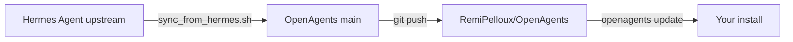

# Staying up to date

OpenAgents is a **rebranded fork** of [Hermes Agent](https://github.com/NousResearch/Hermes-agent). Updates work in two layers:

| Who | Command | What it does |
|-----|---------|--------------|
| **Users & developers** | `openagents update` | Pulls latest **OpenAgents** from `origin` (this repo), refreshes deps, migrates config |
| **Maintainers** | `./scripts/sync_from_hermes.sh` | Merges **Hermes Agent** upstream, re-applies the OpenAgents rebrand, refreshes lockfile |

---

## For everyone: `openagents update`

After cloning [RemiPelloux/OpenAgents](https://github.com/RemiPelloux/OpenAgents):

```bash
openagents update              # pull origin/main + install deps
openagents update --check      # preview only — no changes
openagents doctor              # verify config after an update
```

**Remotes (recommended):**

```bash
git remote -v
# origin    git@github.com:RemiPelloux/OpenAgents.git
# upstream  https://github.com/NousResearch/Hermes-agent.git  # optional; maintainers only
```

- **`origin`** — where normal updates come from (already rebranded OpenAgents).
- **`upstream`** — Hermes Agent source releases. Only needed when you merge new Hermes code into this fork.

If you fork OpenAgents to your own GitHub account, `openagents update` can offer to add `RemiPelloux/OpenAgents` as `upstream` and fast-forward when you have no local-only commits.

---

## For maintainers: sync a new Hermes release

When [NousResearch/Hermes-agent](https://github.com/NousResearch/Hermes-agent) ships a new version:

```bash
# 1. Clean working tree
git status

# 2. One-command sync (merge + rebrand + lockfile + smoke tests)
chmod +x scripts/sync_from_hermes.sh
./scripts/sync_from_hermes.sh

# 3. Review, commit, push
git status
git diff --stat
git commit -am "Sync Hermes upstream and reapply OpenAgents rebrand."
git push origin main

# Or push in one step:
./scripts/sync_from_hermes.sh --push
```

### What the sync script does

1. Ensures `upstream` → `NousResearch/Hermes-agent`
2. `git fetch upstream main`
3. `git merge upstream/main`
4. `python scripts/rename_to_openagents.py` — Hermes → OpenAgents identity layer
5. `uv lock` (when `uv` is installed)
6. Smoke tests on constants + update check

### If merge conflicts occur

```bash
# Resolve conflicts in your editor, then:
git add -A
git merge --continue
python scripts/rename_to_openagents.py
uv lock
python -m pytest tests/test_openagents_constants.py -q
git commit -am "Sync Hermes upstream and reapply OpenAgents rebrand."
```

### Manual equivalent

```bash
git fetch upstream main
git merge upstream/main
python scripts/rename_to_openagents.py
uv lock
uv pip install -e ".[all,dev]"
python -m pytest tests/openagents_cli/ -q
```

---

## Architecture



The rebrand script (`scripts/rename_to_openagents.py`) is **idempotent on an already-rebranded tree** — it only renames paths that still use Hermes names after a merge.

Fork metadata lives in `openagents_fork.py` (distribution URL, Hermes upstream URL, rebrand flag).

---

## Troubleshooting

| Symptom | Fix |
|---------|-----|
| `openagents update` says already up to date but you expect changes | You may be on a fork; ensure `origin` points at RemiPelloux/OpenAgents |
| Pulled raw Hermes names (`hermes_cli/`) | Run `python scripts/rename_to_openagents.py` |
| Merge left conflict markers | Resolve, then re-run rename script before committing |
| Syntax error after update | `openagents update` auto-rolls back; retry after upstream fix lands |

---

## Related

- [README — Quick start](../README.md)
- [Hermes Agent releases](https://github.com/NousResearch/Hermes-agent/releases)
- [OpenAgents releases](https://github.com/RemiPelloux/OpenAgents/releases)
