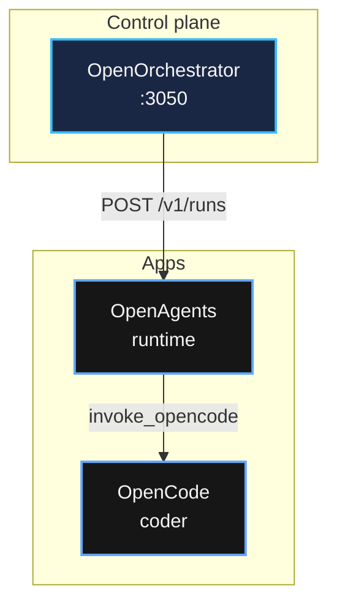

# OpenBrain Chat — Mermaid mesh diagrams

Use when OpenBrain Command Center (or any agent answering about OpenOS mesh) needs a **readable** architecture diagram in chat.

## When to use

- User asks for schema, diagram, architecture, topology, mesh map, flow
- Explaining OpenOrchestrator → OpenAgents → OpenCode hops
- CC-* producer/consumer flows clearer as a diagram than prose

## When not to use

- Simple factual answers with no spatial/flow structure
- User did not ask for visualization and prose is enough

## Rendering contract (UI)

OpenBrain web chat applies a **high-contrast theme** automatically:

- Slate node fills, light text, blue/cyan borders
- **Do not** use `%%{init}%%` — it overrides the UI theme (purple/unreadable)
- UI strips any `%%{init}%%` block if present

## Required classDef palette

Append at end of every mesh diagram (slate + blue/cyan — **never purple/violet fills**):

```text
classDef meshCtrl fill:#1a2744,stroke:#38bdf8,color:#f5f5f5,stroke-width:2px
classDef meshApp fill:#161616,stroke:#60a5fa,color:#f5f5f5,stroke-width:2px
classDef meshData fill:#232323,stroke:#94a3b8,color:#f5f5f5,stroke-width:1px
classDef meshPlane fill:#0f0f0f,stroke:#475569,color:#e5e5e5,stroke-width:1px
```

## Class assignment

| Node type | class |
|-----------|-------|
| OpenOrchestrator, control plane | `meshCtrl` |
| OpenAgents, OpenCode, OpenBrain, OpenTicket, OpenCRM, app APIs | `meshApp` |
| Connectors, OpenPro, OpenTeam, external data | `meshData` |
| Subgraph / plane wrapper (Brain, Audit, MCP) | `meshPlane` |

Example: `class OpenOrchestrator,Orch meshCtrl`

## Layout rules

1. Prefer `flowchart TB` or `flowchart LR`
2. Use `subgraph` per layer: Control plane / Apps / Brain & audit
3. **Short labels:** line 1 = name, line 2 = role or port with `<br/>`
4. Edge labels: contract id or transport (`POST /v1/runs`, `MCP`, `RecEvent`)
5. OpenOrchestrator → OpenAgents only — never OpenCode direct

## OpenOrchestrator vs OpenAgents (do not conflate)

| | OpenOrchestrator | OpenAgents |
|---|---|---|
| Role | Plan, approve, route | Execute profiles |
| Stack | TypeScript :3050 | Python gateway |
| OpenCode | Never | Yes via `invoke_opencode` |

## Example (minimal)

````markdown

````

## Verification

- [ ] Diagram includes classDef block (no purple)
- [ ] No `%%{init}%%`
- [ ] OpenOrchestrator not shown calling OpenCode directly
- [ ] Labels readable (max ~2 lines per node)
